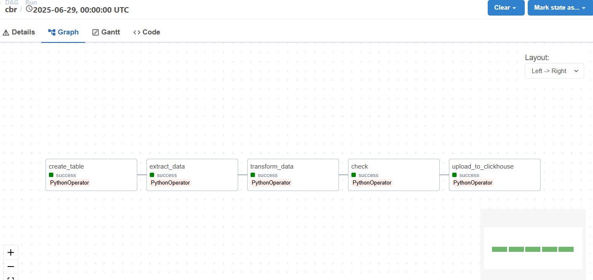
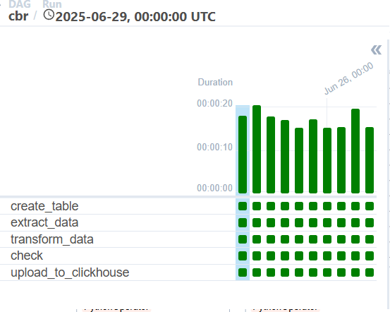
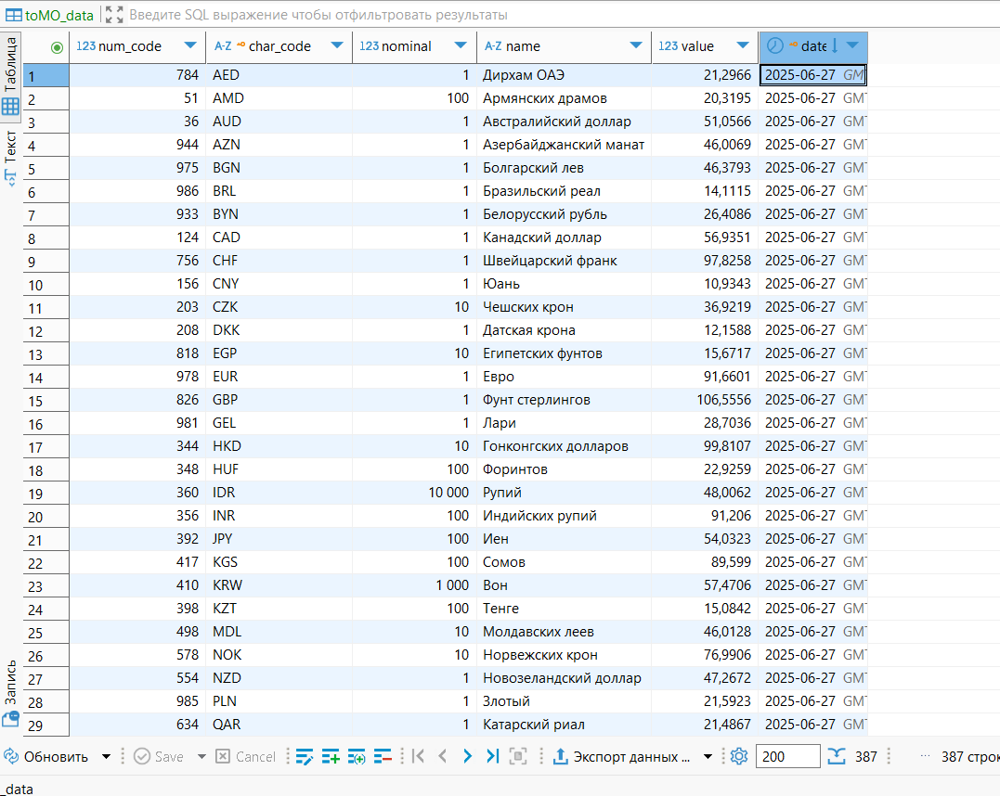

# 🌀Airflow DAG: Загрузка курсов валют ЦБ РФ

## Описание
DAG для ежедневной загрузки курсов валют с сайта Центробанка России.

## Особенности
- Парсинг XML данных с cbr.ru
- Загрузка в ClickHouse
- Обработка ошибок
- Логирование
- Для анализа доступна [тестовая выгрузка курсов валют](docs/выгрузка%20из%20бд.csv) за период с 19.06.2025 по 28.06.2025.

## Скриншоты
схема графа

скрин выполненных задач , даг запустился 29.06 и отработал за 10 дней, так как в параметрах 
```python
DAG_START_DATE = datetime(2025, 6, 19)
```
 прописано такое начало , я ограничил время дага 28 числом.
<br>
скрин успешно выполненных задач<br>




